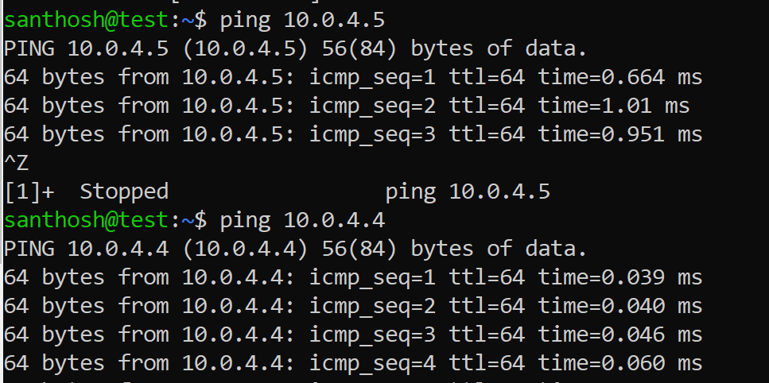

## Basic metrics of the machine

# Communicate with each other server using Vnet

**Create Instance Using PowerShell Azure:** 

| **Step** | **Script**                                                                                                                                                                                                                                                   | **comment**                                                                                          |
|----------|--------------------------------------------------------------------------------------------------------------------------------------------------------------------------------------------------------------------------------------------------------------|------------------------------------------------------------------------------------------------------|
| 1        | az group create --name SanthoshResourceGroup --location eastus                                                                                                                                                                                               | Need to create resource group                                                                        |
| 2        | az network vnet create --address-prefixes 10.0.0.0/16 --name SanthoshVirtualNetwork --resource-group SanthoshResourceGroup --subnet-name SanthoshSubnet --subnet-prefixes 10.0.0.0/24                                                                        | Create new subnet attached to an Existing Resource group                                             |
| 3        | az vm create --resource-group SanthoshResourceGroup --name santhosh-vm1 --image UbuntuLTS --generate-ssh-keys --output json   az vm create --resource-group SanthoshResourceGroup --name santhosh-vm2 --image UbuntuLTS --generate-ssh-keys --output json    |  Create two new virtual machine running Ubuntu, which uses SSH authentication for login.             |
| 4        | ssh public-IP                                                                                                                                                                                                                                                | Confirm that the VM is running by connecting over SSH. Example: ssh 40.117.251.17 ssh 52.149.228.205 |
| 5        | az vm show --name santhosh-vm1 --resource-group SanthoshResourceGroup                                                                                                                                                                                        | List information from a resource.                                                                    |

**Output for the Script**

**Step 1:**

{

"id":
"/subscriptions/9c3f0560-dfaa-49c4-9ae0-6b4782b2811f/resourceGroups/SanthoshResourceGroup",

"location": "eastus",

"managedBy": null,

"name": "SanthoshResourceGroup",

"properties": {

"provisioningState": "Succeeded"

},

"tags": null,

"type": "Microsoft.Resources/resourceGroups"

}

**Step 2:**  
{

"newVNet": {

"addressSpace": {

"addressPrefixes": [

"10.0.0.0/16"

]

},

"bgpCommunities": null,

"ddosProtectionPlan": null,

"dhcpOptions": {

"dnsServers": []

},

"enableDdosProtection": false,

"enableVmProtection": false,

"etag": "W/\\"803f94c6-f97e-4d62-bdf5-30bd05e4b99d\\"",

"extendedLocation": null,

"id":
"/subscriptions/9c3f0560-dfaa-49c4-9ae0-6b4782b2811f/resourceGroups/SanthoshResourceGroup/providers/Microsoft.Network/virtualNetworks/SanthoshVirtualNetwork",

"ipAllocations": null,

"location": "eastus",

"name": "SanthoshVirtualNetwork",

"provisioningState": "Succeeded",

"resourceGroup": "SanthoshResourceGroup",

"resourceGuid": "28e5ec4b-4ea8-4cc2-88c4-0e1ad862bad2",

"subnets": [

{

"addressPrefix": "10.0.0.0/24",

"addressPrefixes": null,

"delegations": [],

"etag": "W/\\"803f94c6-f97e-4d62-bdf5-30bd05e4b99d\\"",

"id":
"/subscriptions/9c3f0560-dfaa-49c4-9ae0-6b4782b2811f/resourceGroups/SanthoshResourceGroup/providers/Microsoft.Network/virtualNetworks/SanthoshVirtualNetwork/subnets/SanthoshSubnet",

"ipAllocations": null,

"ipConfigurationProfiles": null,

"ipConfigurations": null,

"name": "SanthoshSubnet",

"natGateway": null,

"networkSecurityGroup": null,

"privateEndpointNetworkPolicies": "Enabled",

"privateEndpoints": null,

"privateLinkServiceNetworkPolicies": "Enabled",

"provisioningState": "Succeeded",

"purpose": null,

"resourceGroup": "SanthoshResourceGroup",

"resourceNavigationLinks": null,

"routeTable": null,

"serviceAssociationLinks": null,

"serviceEndpointPolicies": null,

"serviceEndpoints": null,

"type": "Microsoft.Network/virtualNetworks/subnets"

}

],

"tags": {},

"type": "Microsoft.Network/virtualNetworks",

"virtualNetworkPeerings": []

}

}

**Step 3:**  
{- Finished ..

"fqdns": "",

"id":
"/subscriptions/9c3f0560-dfaa-49c4-9ae0-6b4782b2811f/resourceGroups/SanthoshResourceGroup/providers/Microsoft.Compute/virtualMachines/santhosh-vm1",

"location": "eastus",

"macAddress": "00-0D-3A-8D-92-7E",

"powerState": "VM running",

"privateIpAddress": "10.0.0.4",

"publicIpAddress": "52.149.228.205",

"resourceGroup": "SanthoshResourceGroup",

"zones": ""

}
**output:**

# Another way two comunicate using public address:
>   **Step 1:** need to generate ssh key in both machines.  
>   command: ssh-keygen

>   **Step 2:** add ssh key into another machine.

command: vi \~/.ssh/authorized\_keys

>   \#server hosts

>   52.172.141.163 test1

>   40.80.92.13 test

**Output:**

