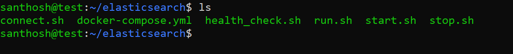
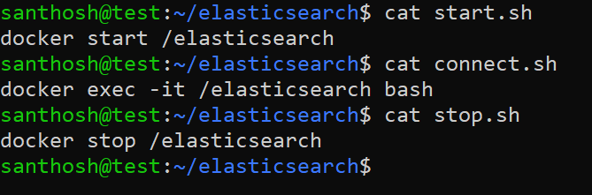
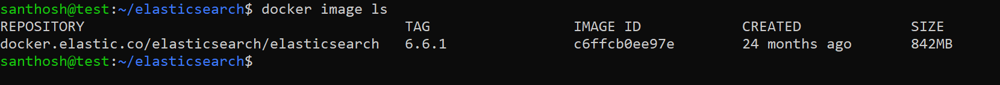
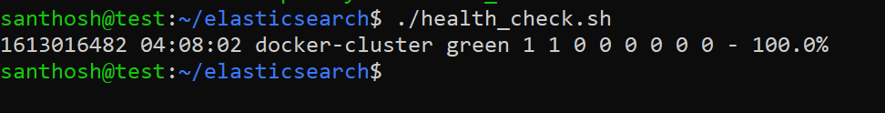
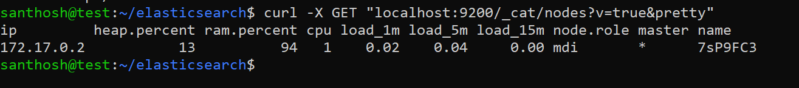

## 2. Elasticsearch Installation in a docker container 

# Installing Elasticsearch using Docker 

**Step 1:**

Installed docker in the machine. Need to follow the list of steps.
| **#no** | **script**                                                                                                                                                                                          | **comment**                                                                                  |
|---------|-----------------------------------------------------------------------------------------------------------------------------------------------------------------------------------------------------|----------------------------------------------------------------------------------------------|
| 1       | sudo apt install docker.io                                                                                                                                                                          | Install docker services.                                                                     |
| 2       | sudo usermod -aG docker \${USER}                                                                                                                                                                    | Add user to the docker group.  Note : Need to log out and log back for updating group user.  |
| 3       | \# --network=elastic_search \\ docker run -d \\  -p 9200:9200 \\  -p 9300:9300 \\  --name elasticsearch \\  -e "discovery.type=single-node" \\  docker.elastic.co/elasticsearch/elasticsearch:6.6.1 | Need to install Elasticsearch using docker image                                             |
| 4       | docker start /elasticsearch                                                                                                                                                                         | Need to start docker                                                                         |
| 5       | curl -s localhost:9200/_cat/health                                                                                                                                                                  | Health check of Elastic search                                                               |

**Output:**

**Step2:** check the Elasticsearch health  
**script:** <i>curl -s localhost:9200/_cat/health </i>
            <i>curl -X GET "localhost:9200/_cat/nodes?v=true&pretty"  </i>
            
**output:**

