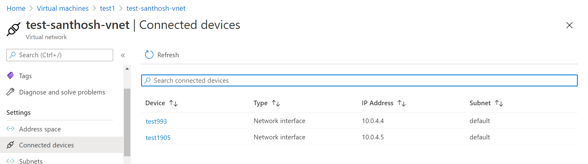
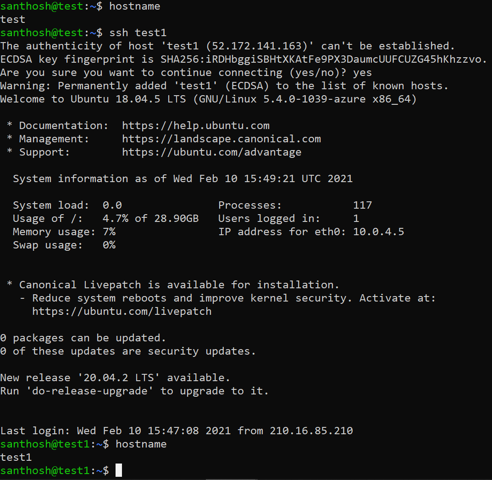

## Basic metrics of the machine

# Communicate with each other server using private IP

>**Vnet**
The virtual network that the VMs use to communicate with each other and the internet.
>**script**
az network vnet create \
  --resource-group testsanthosh \
  --name test-santhosh-vnet \
  --address-prefix 10.0.0.0/16 \
  --subnet-name santhoshSubnet \
  --subnet-prefix 10.0.4.0/24
  
**output:**

# Another way two comunicate using public address:
>   **Step 1:** need to generate ssh key in both machines.  
>   command: ssh-keygen

>   **Step 2:** add ssh key into another machine.

command: vi \~/.ssh/authorized\_keys

>   \#server hosts

>   52.172.141.163 test1

>   40.80.92.13 test

**Output:**

