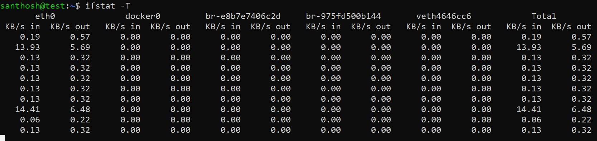

# Basic metric of the Linux machine

**Step 1:** CPU, Disk, RAM, and Network Usage:

| \#No | Items         | Scripts                                                          | comments                             |
|------|---------------|------------------------------------------------------------------|--------------------------------------|
| 1    | CPU           | top -bn1 \| grep load \| awk '{printf "%.2f%%\\t\\n", \$(NF-2)}' | List the percentage of CPU usage     |
| 2    | DISK          | df -h \| awk '\$NF=="/"{printf "%s\\t", \$5}'                    | List the percentage of Disk usage    |
| 3    | RAM           | free -m \| awk 'NR==2{printf "\\t%.2f%%\\t", \$3\*100/\$2 }'     | List the percentage of RAM usage     |
| 4    | Network Usage | sudo apt-get install ifstat ifstat -T                            | List the percentage of Network usage |

**Step 2:** Automation script creating for the environment

**Step 3:** Automated script using cronjob.

**Step 4:** Appended output from metrics.log files.  
**output:**  

Network Usage report:

