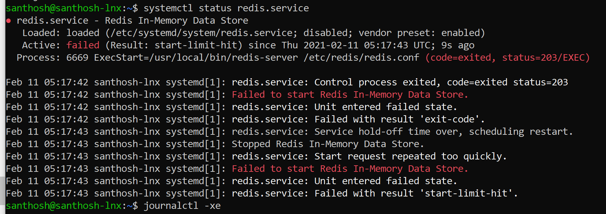
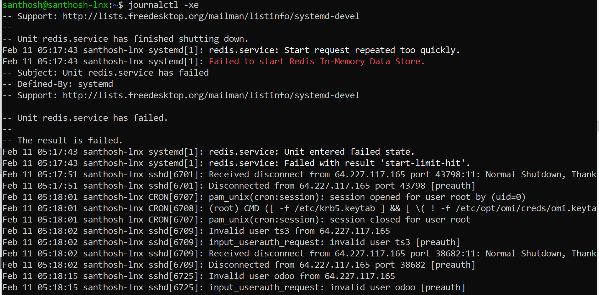
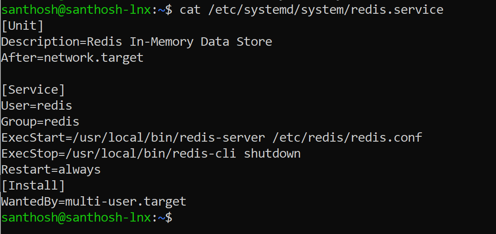
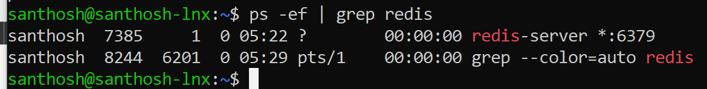
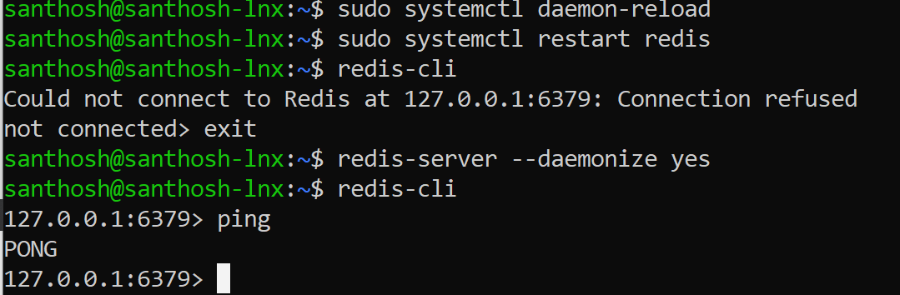

## Linux Problem solving

# Ubuntu Diagnose and solve the Redis server issue

**Step 1:** Need to check the status of Redis server.

**Script:** sudo systemctl status redis.service

Although Even rebooting the system could not help, in my case it was because of
a running background process which was found using:

ss -tulpn

killed it.

kill [process id/number]

Afterwards I could start redis service again.

Sudo systemctl service start redis

**Step 2:** Missed to add list of items in /etc/systemd/system/redis.service.  

**Step 3:** Need to start Redis-server as well. Redis-server –daemonize yes

