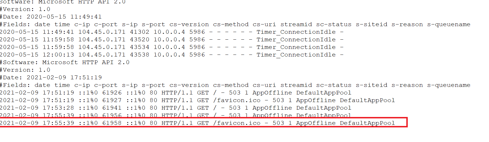
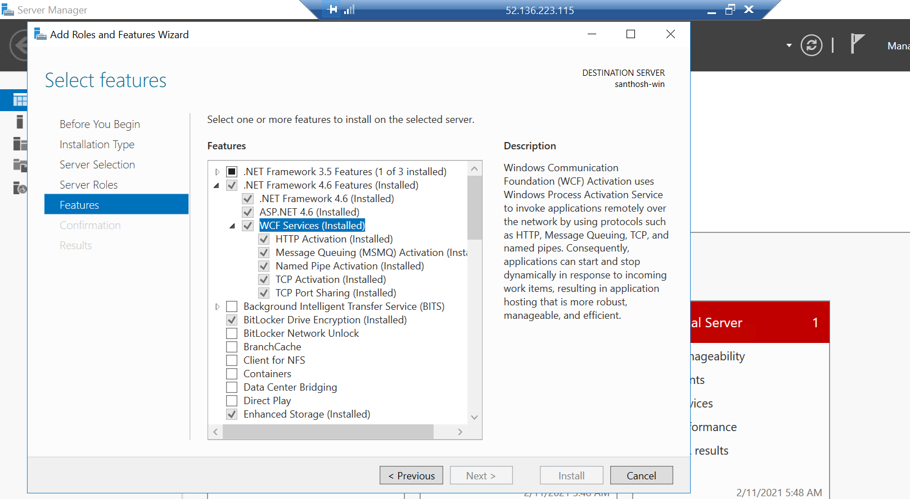
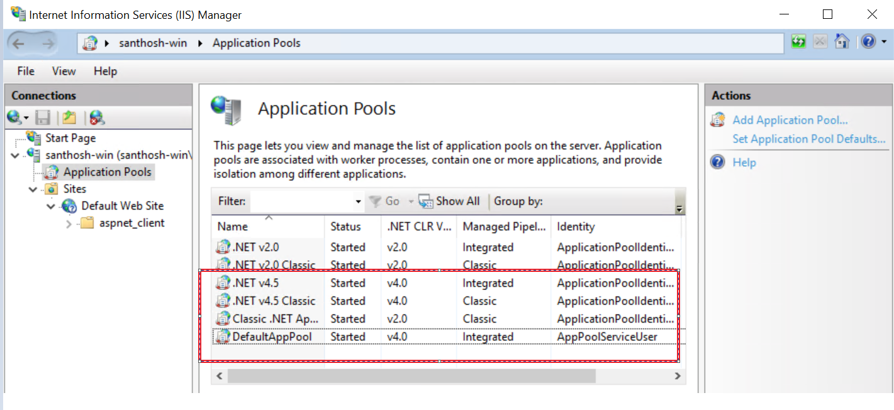
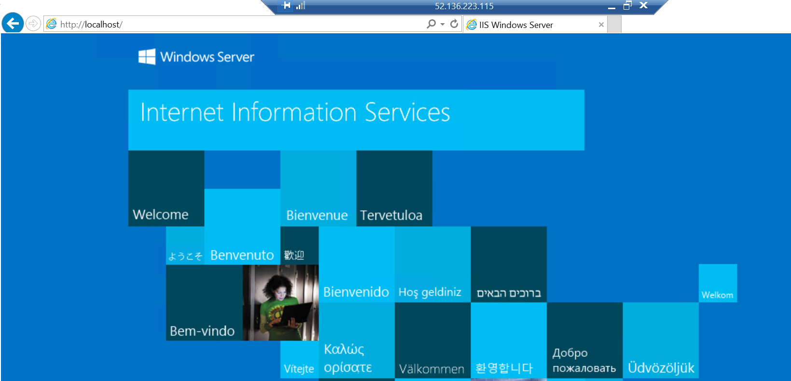

## Windows problem solving

# Windows Web applications diagnose

Step 1: Need to check widows errors log

C:\\Windows\\System32\\LogFiles\\HTTPERR

# 

Step 2: Enabled HTTP Activation.

Step 3: Started Application pools as well.

**Output:**  
****

# Conclusion

As per the given tasks hereby I’m submitting my assignment. Review the document
and send your feedback.
