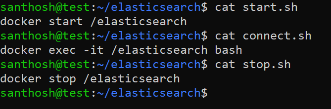
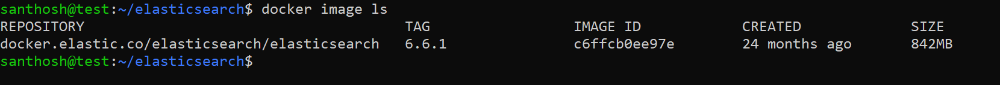
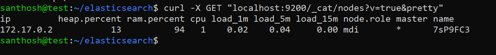
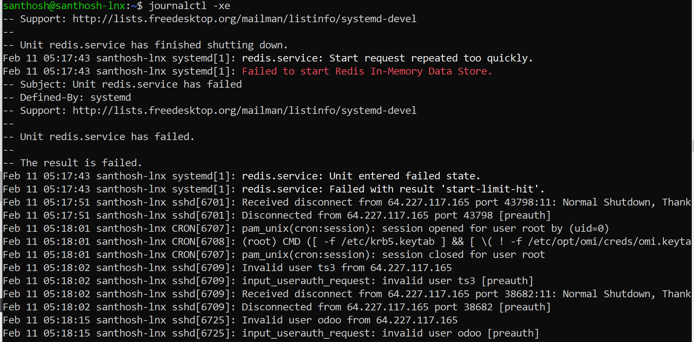
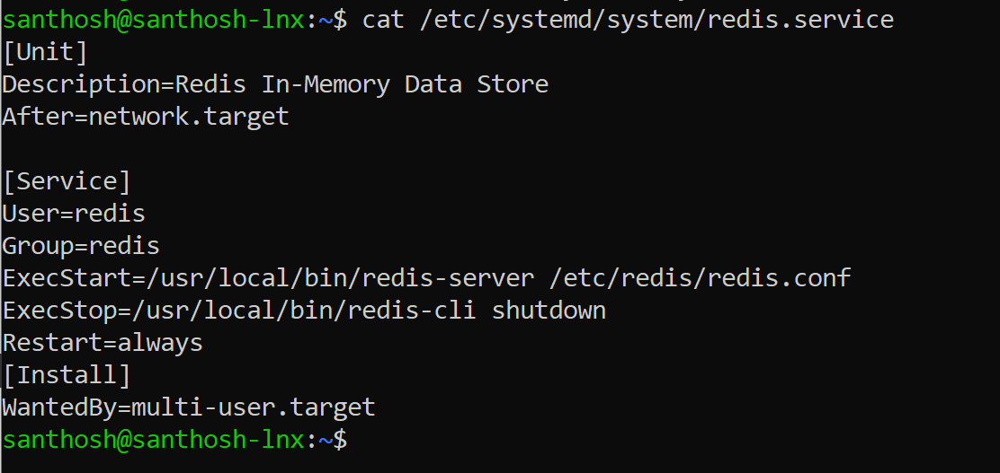
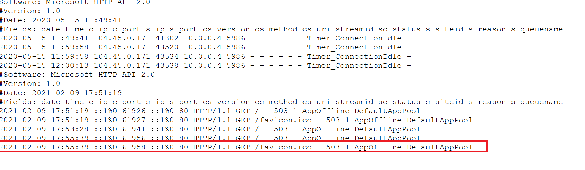
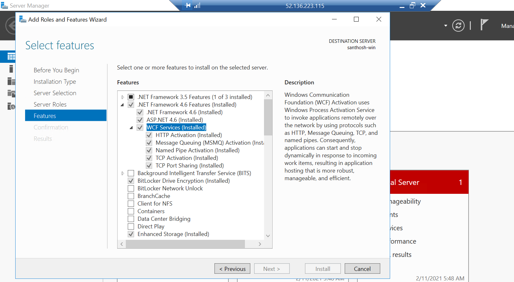
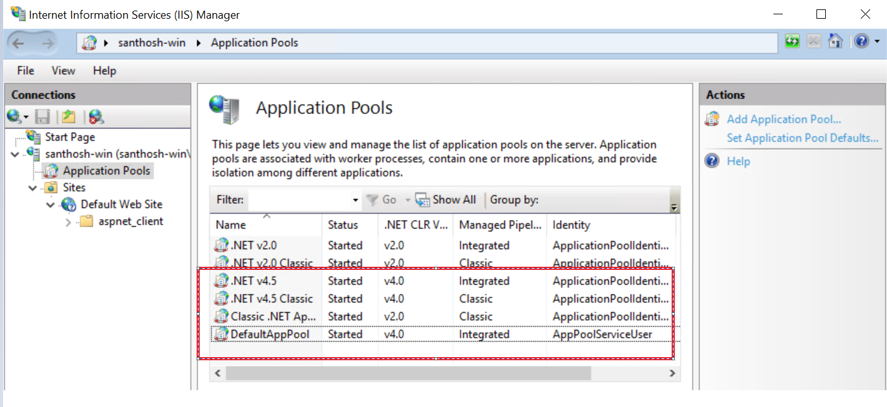
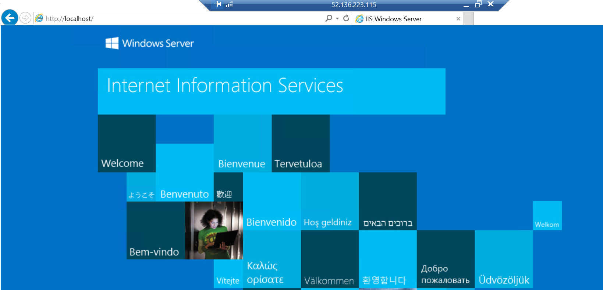

>   Cloud Operation Assessment

santhosh

>   **Table of Contents**

[1	Create an Azure free trial account	2](#_Toc63936388)

[2	Setup SSH connection for both machine	2](#_Toc63936389)

[3	Exercise	3](#_Toc63936390)

>   [3.1	Basic metrics of the machine	3](#_Toc63936391)

[Article I.	Communicate with each other server	3](#_Toc63936392)

[Article II.	Basic metric of the Linux machine	4](#_Toc63936393)

>   [3.2	Elasticsearch Installation in a docker container	6](#_Toc63936394)

[Article III.	Installing Elasticsearch using Docker	6](#_Toc63936395)

>   [3.3	Linux Problem solving	7](#_Toc63936396)

[Article IV.	Ubuntu Diagnose and solve the Redis server issue	7](#_Toc63936397)

>   [3.4	Windows problem solving	9](#_Toc63936398)

[Article V.	Windows Web applications diagnose	9](#_Toc63936399)

[4	Conclusion	11](#_Toc63936400)

#  Azure free trial account

Created two ubuntu instance for exercise in Azure free trail account.

| IP ADDRESS     | USERNAME | vCPUs | RAM    |
|----------------|----------|-------|--------|
| 40.80.92.13    | santhosh | 1     | 3.5 GB |
| 52.172.141.163 | santhosh | 1     | 3.5 GB |

# Setup SSH connection for both machine

Created ssh-key and configured both machines.

**Server 1:**

**Server 2:**

# Exercise 

## Basic metrics of the machine

# Communicate with each other server

>   **Step 1:** need to generate ssh key in both machines.  
>   command: ssh-keygen

>   **Step 2:** add ssh key into another machine.

command: vi \~/.ssh/authorized\_keys

>   \#server hosts

>   52.172.141.163 test1

>   40.80.92.13 test

**Output:**

# Basic metric of the Linux machine

**Step 1:** CPU, Disk, RAM, and Network Usage:

| \#No | Items         | Scripts                                                          | comments                             |
|------|---------------|------------------------------------------------------------------|--------------------------------------|
| 1    | CPU           | top -bn1 \| grep load \| awk '{printf "%.2f%%\\t\\n", \$(NF-2)}' | List the percentage of CPU usage     |
| 2    | DISK          | df -h \| awk '\$NF=="/"{printf "%s\\t", \$5}'                    | List the percentage of Disk usage    |
| 3    | RAM           | free -m \| awk 'NR==2{printf "\\t%.2f%%\\t", \$3\*100/\$2 }'     | List the percentage of RAM usage     |
| 4    | Network Usage | sudo apt-get install ifstat ifstat -T                            | List the percentage of Network usage |

**Step 2:** Automation script creating for the environment

**Step 3:** Automated script using cronjob.

**Step 4:** Appended output from metrics.log files.  
**output:**  

Network Usage report:

## Elasticsearch Installation in a docker container 

# Installing Elasticsearch using Docker 

**Step 1:**

Installed docker in the machine. Need to follow the list of steps.

**Output:**

**Step2:** check the Elasticsearch health  
**script:** curl -s localhost:9200/_cat/health

curl -X GET "localhost:9200/_cat/nodes?v=true&pretty"  
**output:**

## Linux Problem solving

# Ubuntu Diagnose and solve the Redis server issue

**Step 1:** Need to check the status of Redis server.

**Script:** sudo systemctl status redis.service

Although Even rebooting the system could not help, in my case it was because of
a running background process which was found using:

ss -tulpn

killed it.

kill [process id/number]

Afterwards I could start redis service again.

Sudo systemctl service start redis

**Step 2:** Missed to add list of items in /etc/systemd/system/redis.service.  

**Step 3:** Need to start Redis-server as well. Redis-server –daemonize yes

## Windows problem solving

# Windows Web applications diagnose

Step 1: Need to check widows errors log

C:\\Windows\\System32\\LogFiles\\HTTPERR

# 

Step 2: Enabled HTTP Activation.

Step 3: Started Application pools as well.

**Output:**  
****

# Conclusion

As per the given tasks hereby I’m submitting my assignment. Review the document
and send your feedback.
